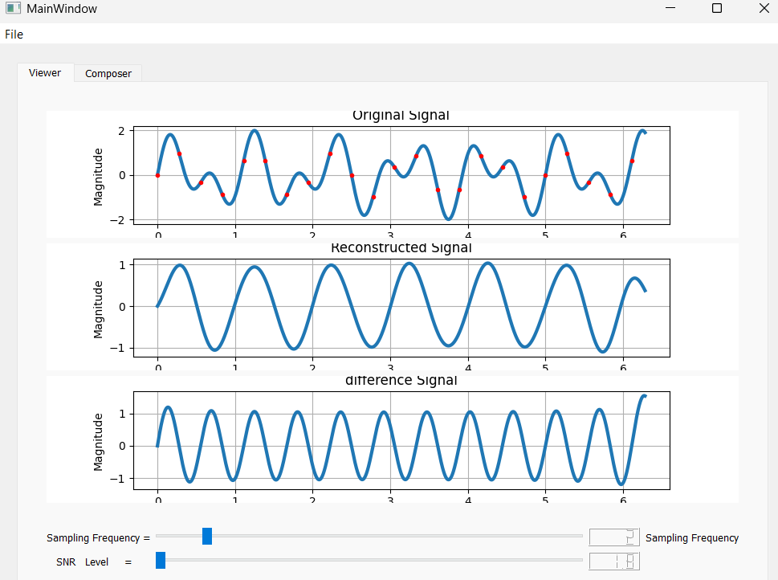
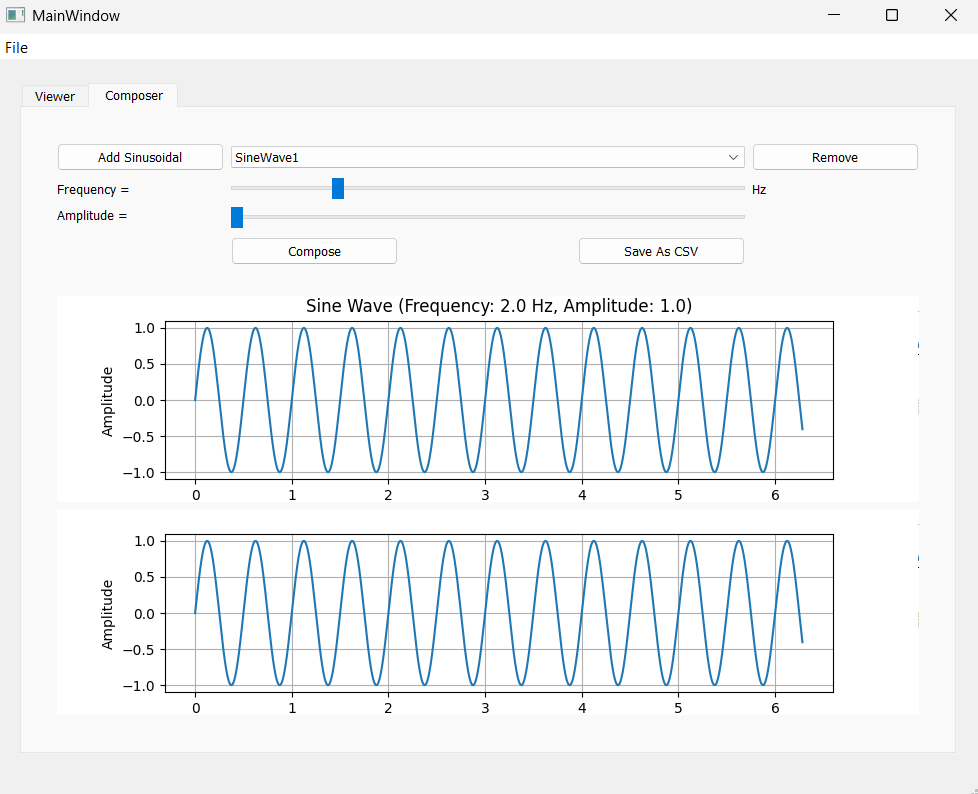

# Nyquist Theorem Signal Sampling Simulator

A desktop DSP learning app built with PyQt5 that helps you explore sampling, reconstruction, aliasing behavior, and noise effects in an interactive way.

This project combines:
- Signal loading (CSV and ECG headers)
- Interactive sampling frequency control
- SNR/noise adjustment
- Sine-wave composition tools
- Real-time plots for original, reconstructed, and difference signals

---

## Why This Project Is Useful

Sampling theory is easier to understand when you can see it live.

This simulator lets you:
- Visually compare original and reconstructed waveforms
- Experiment with under-sampling and over-sampling
- Observe reconstruction error directly
- Build custom test signals from multiple sine waves

---

## Feature Highlights

- Interactive viewer with three synchronized plots:
  - Original signal
  - Reconstructed signal
  - Difference/error signal
- Composer tab to create custom multi-sine test signals
- Adjustable sampling frequency slider
- Adjustable SNR slider for noise experiments
- CSV export for composed signals
- ECG input support using WFDB

---

## Demo Placeholders (Add Your Screenshots and GIFs)

### 1) Main Viewer Screenshot



### 2) Signal Composer Screenshot


### 3) Sampling Frequency Demo GIF


## Project Structure

- main.py: PyQt5 UI and interaction flow
- signals.py: Signal processing and reconstruction logic
- sinwaves.py: Sine-wave model and generation
- signal_service.py: Helper services for CSV metadata and sine-wave composition
- requirements.txt: Python dependencies

---

## Quick Start

### 1) Create and activate virtual environment

Windows PowerShell:

```powershell
python -m venv .venv
.\.venv\Scripts\Activate.ps1
```

### 2) Install dependencies

```powershell
pip install -r requirements.txt
```

### 3) Run the app

```powershell
python main.py
```

---

